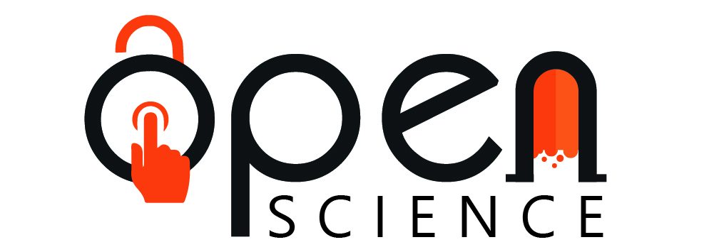
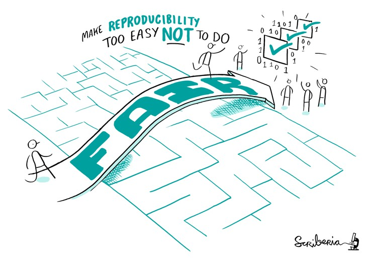
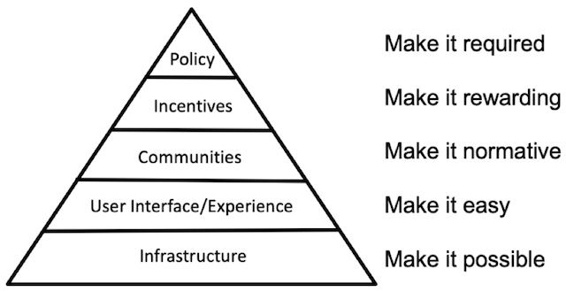
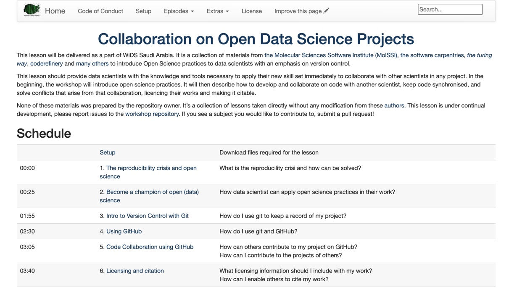
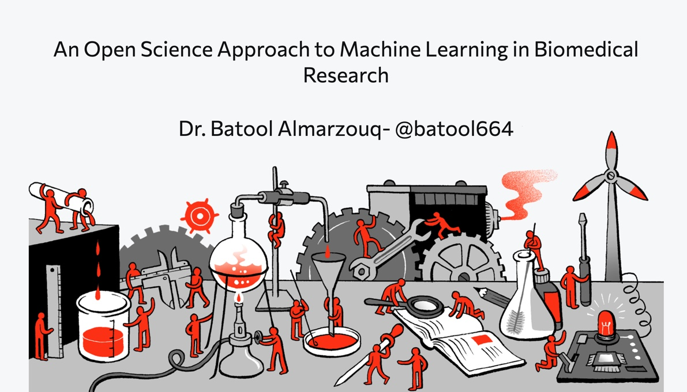
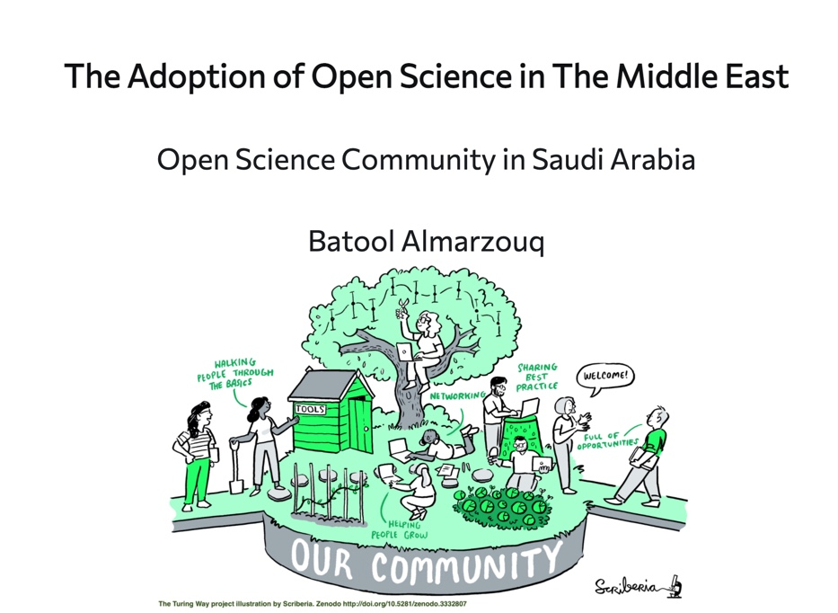
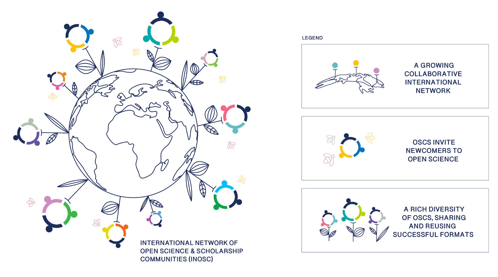

```{r setup, include=FALSE}
options(htmltools.dir.version = FALSE, servr.interval = 0.05)
knitr::opts_chunk$set(collapse = TRUE, fig.retina = 3)
library(xaringanExtra)
library(xaringan)
```


```{r share-again, echo=FALSE}
xaringanExtra::use_share_again()
xaringanExtra::use_tachyons()
```


class: title-slide, center, top
background-image: url(figs/balance.jpg)
background-size: contain
background-color: #FFFFFF
background-position: bottom
background-size: 70%


#### `r rmarkdown::metadata$title`

### `r rmarkdown::metadata$author`

---
class:  middle, inverse
###### A little about me !

- A computational biologist affiliated with [the University of Liverpool](https://www.liverpool.ac.uk/), UK.
- Founder of [RLadies Chapter in Saudi Arabia (Dammam)](https://www.meetup.com/rladies-dammam/).
- A member in both the [R Weekly](https://rweekly.org/about) team and MiR accessibility committee.
- Member of several Open Science Communities such as the _turing way_ in [the Alan Turing Institutes](https://www.turing.ac.uk/).
- I joined recently Code Review Community Working Group (CRC) which aims to build consensus and awareness around good practice in code review.


---

background-image: url(figs/open-science-evolving.jpg)
background-size: contain
background-color: #FFFFFF
background-position: right
background-size: 55%

.left[.footnote[The Turing Way project illustration by Scriberia. Zenodo. http://doi.org/10.5281/zenodo.3332807]]

.pull-left[
#### What is Open Science?
#####In a nutshell, Open Science describes an on-going movement in the way research is performed, researchers collaborate, knowledge is shared, and science is organised. It affects the whole research cycle and its stakeholders, enhances science by facilitating more transparency, openness, networking and collaboration. — OpenAIRE]

---

class: center, middle
background-image: url(figs/reproducibility-circle2.png)
background-size: 75%
background-color: #f3f3f3
class: top
#### Open Science aims to fix the "Reproducibility Crisis" in Science

.footnote[Credit: Key results of the survey on reproducibility conducted by [Nature in 2016](https://www.nature.com/news/1-500-scientists-lift-the-lid-on-reproducibility-1.19970)]

---
class: center, middle, inverse
###### After the pandemic, 193 countries gathered in Paris for the 40th session of the UNESCO's General Conference and decided to embark on a new global normative instrument on Open Science. It's referred to as the "UNESCO Recommendation on Open Science". 

.left[.footnote[Credit: [UNESCO Takes the Lead in Developing a New Global Standard-setting Instrument on Open Science](https://en.unesco.org/news/unesco-takes-lead-developing-new-global-standard-setting-instrument-open-science)]]
--

###### This process is expected to lead to the adoption of the recommendation by UNESCO Member States in 2021. 


---

class: center, middle, inverse

###### Therefore, there is an increasing number of Open Science Communities in Europe

--

###### A vast network of Open Science Communities is in the Netherlands, Sweden, Germany, UK and many other countries ...

--

###### BUT Open Science movement is not yet adopted in the Middle East


---

class: center, middle, inverse
###### In 2021, We started an Open Science Community in Saudi Arabia

--

###### We are in the process of re-designing Open Science for Saudi Arabia to  potentially be adopted by the other countries in the Middle East



.left[.footnote[Credit: The logo is adopted from Malaysia Open Science Platform]]
---

class: center, middle, inverse

###### The Open Science Community in Saudi Arabia is supported by [Open Life Science Programme](https://openlifesci.org/)


###### Led by Batool Almarzouq, Anelda Van der Walt and Paula Moraga

---
class: center, middle

#### Our Vision statement 

.bg-white.b--purple.ba.bw2.br3.shadow-5.ph4.mt5[
We want to create a space in Saudi Arabia where newcomers and seasoned peers can connect, inspire each other, and provide input on policies and infrastructures. Working together to make Open Science the norm. So, we are calling out to researchers and colleagues in Saudi Arabia.

.tr[
— The Open Science community in Saudi Arabia 
]]

.left[.footnote["The vision is largely inspired by the vision of the International Network of Open Science Communities (INOSC)"]]

---

class: center, middle
background-color: #FFFFFF



.left[.footnote[The Turing Way project illustration by Scriberia. Zenodo. http://doi.org/10.5281/zenodo.3332807]]
---
class: center, middle
background-color: #FFFFFF



.left[.footnote[The pyramid of culture change. Image by Brian Nosek (licensed under CC BY-ND 4.0), reproduced from the blog post Strategy for Culture Change.]]
---
class: center, middle, inverse

## Examples of our activities in Feb 2021

###### - A workshop in Women in Data Science (WiDS2021) in Saudi Arabia, under the title ["Collaborating on Open Data Science Projects"](https://batoolmm.github.io/Collaborating-on-Open-Data-Science-Projects/)




.left[.footnote[All of our work is citable and available in [Zenodo](https://zenodo.org/communities/1231231664/?page=1&size=20)and GitHub]]
---

class: center, middle, inverse
## Examples of our activities in Feb 2021

###### - A talk titled ["An Open Science Approach to Machine Learning in Biomedical Research"](https://saudi-data-community.netlify.app/#1) in the Saudi Data Community.



.left[.footnote[All of our work is citable and available in [Zenodo](https://zenodo.org/communities/1231231664/?page=1&size=20) and GitHub]]

---

class: center, middle, inverse
## Examples of our activities in March 2021

###### - We contributed to the Open Education Week ["The Adoption of Open Science in The Middle East"](https://open-science-week.netlify.app/#1)



.left[.footnote[All of our work is citable and available in [Zenodo](https://zenodo.org/communities/1231231664/?page=1&size=20) and GitHub]]

---

class: center, middle, inverse
## Plans for March 2021

###### -  I have a meeting with the International Network of Open Science Communities (INOSC) to discuss the possibility to join them.



---

class: middle, inverse
## More Plans ...

###### -  We want to establish a digital presence (e.g. Website and social media accounts). We already have a community in Zenodo and GitHub organisation account.

###### - We want to start to build a local community for the carpentries in the Middle East (I'm designing a lesson about scRNA-seq in the carpentries) and with the R community.


---
class: middle, inverse

## Plans for March 2021

###### - Encourage Saudi to get involved in the global useR conference 2021 (deadline for talks submission is the 10th of March).

###### - We planning for a mentorship programe in the summer.

###### - I'm delivering a workshop as a part of [Repro4Everyone](https://repro4everyone.org/) and helping with collaborative workshop runs by the turing way in [Software Sustainability Institute (SSI)](https://software.ac.uk/). 

---
class: middle, inverse, center

###### Thank you so much 
###### We are very welcoming to any contribution!

