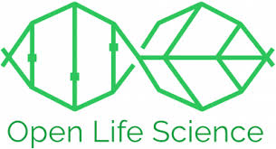

```{r setup, include=FALSE}
options(htmltools.dir.version = FALSE, servr.interval = 0.05)
knitr::opts_chunk$set(collapse = TRUE, fig.retina = 3)
library(xaringanExtra)
library(xaringan)
```


```{r share-again, echo=FALSE}
xaringanExtra::use_share_again()
xaringanExtra::use_tachyons()
```


class: title-slide, center, top
background-image: url(figs/balance.jpg)
background-size: contain
background-color: #FFFFFF
background-position: bottom
background-size: 70%


#### `r rmarkdown::metadata$title`

### `r rmarkdown::metadata$author`

---
class:  middle, inverse
###### A little about me !

- A computational biologist affiliated with [the University of Liverpool](https://www.liverpool.ac.uk/), UK.
- Member of several Open Science Communities such as the _turing way_ in [the Alan Turing Institutes](https://www.turing.ac.uk/).
- I'm also involved with the [Carpentries](https://carpentries.org/)
- Founder of [RLadies Chapter in Saudi Arabia (Dammam)](https://www.meetup.com/rladies-dammam/).
- A member in both the [R Weekly](https://rweekly.org/about) team and MiR accessibility committee.


---

class: center, middle, inverse
###### In 2021, We started an Open Science Community in Saudi Arabia

--

###### We are in the process of re-designing Open Science for Saudi Arabia to  potentially be adopted by the other countries in the Middle East


.left[.footnote[Credit: The logo is adopted from Malaysia Open Science Platform]]
---

class: center, middle, inverse

###### The Open Science Community in Saudi Arabia is supported by [Open Life Science Programme](https://openlifesci.org/)



###### Led by Batool Almarzouq, Anelda Van der Walt and Paula Moraga

---
class: center, middle, inverse

## Examples of our activities in Feb 2021

###### - A workshop in Women in Data Science (WiDS2021) in Saudi Arabia, under the title ["Collaborating on Open Data Science Projects"](https://batoolmm.github.io/Collaborating-on-Open-Data-Science-Projects/)


.left[.footnote[All of our work is citable and available in [Zenodo](https://zenodo.org/communities/1231231664/?page=1&size=20)and GitHub]]
---

class: center, middle, inverse
## Examples of our activities in Feb 2021

###### - A talk titled ["An Open Science Approach to Machine Learning in Biomedical Research"](https://saudi-data-community.netlify.app/#1) in the Saudi Data Community.


.left[.footnote[All of our work is citable and available in [Zenodo](https://zenodo.org/communities/1231231664/?page=1&size=20) and GitHub]]

---

class: center, middle, inverse
## Examples of our activities in March 2021

###### - We contributed to the Open Education Week ["The Adoption of Open Science in The Middle East"](https://open-science-week.netlify.app/#1)


.left[.footnote[All of our work is citable and available in [Zenodo](https://zenodo.org/communities/1231231664/?page=1&size=20) and GitHub]]

---

class: center, middle, inverse
## Plans for March 2021


###### -  We want to establish a digital presence (e.g. Website and social media accounts). We already have a community in Zenodo and GitHub organisation account.

###### - We want to start to build a local community for the carpentries in the Middle East (I'm designing a lesson about scRNA-seq in the carpentries).


---
class: middle, inverse

## More Plans ...

###### - We want to encourage researchers in Saudi Arabia to get involved in the global useR conference 2021 (deadline for talks is the 10th of March).

###### - We planning to produce a newsletter, arrange for [ReproHack](https://reprohack.github.io/reprohack-hq/) and a mentorship programme in the summer. We are also in discussion with the legal team to register the community.

###### - I'm delivering a workshop as a part of [Repro4Everyone](https://repro4everyone.org/) and helping with collaborative workshop runs by the turing way in [Software Sustainability Institute (SSI)](https://software.ac.uk/). 

---
class: middle, inverse, center

###### Thank you so much 
###### We are very welcoming to any contribution!


.left[.footnote[The Turing Way project illustration by Scriberia. Zenodo. http://doi.org/10.5281/zenodo.3332807]]

